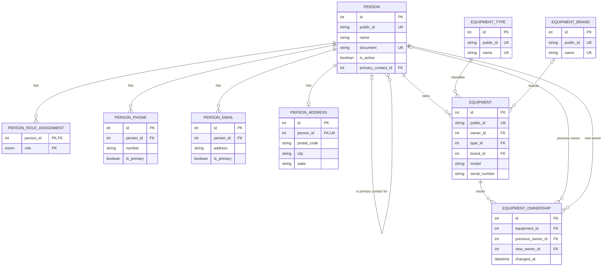

# Diagrama de Entidades

## Objetivo

Apresentar os relacionamentos do modelo atualmente implementado no Prisma. Este diagrama cobre apenas o primeiro recorte de cadastros e equipamentos.

## Status

Diagrama inicial documentado; corresponde ao schema Prisma em 06/10/2026. A migration ainda não foi aplicada em um MySQL.

## Última atualização

06/10/2026.

## Diagrama

## Observações

- O diagrama mostra relações e restrições principais; os campos completos estão em `docs/modelagem/Modelo-Banco.md` e `backend/prisma/schema.prisma`.
- Serial de equipamento não possui unicidade por decisão funcional: a aplicação poderá alertar sobre coincidências e permitir um novo cadastro.
- A relação de pessoa de contato é opcional e autorreferenciada em `people`.

## Histórico de alterações

| Data | Alteração |
| --- | --- |
| 06/10/2026 | Primeiro diagrama do recorte de pessoas e equipamentos. |
