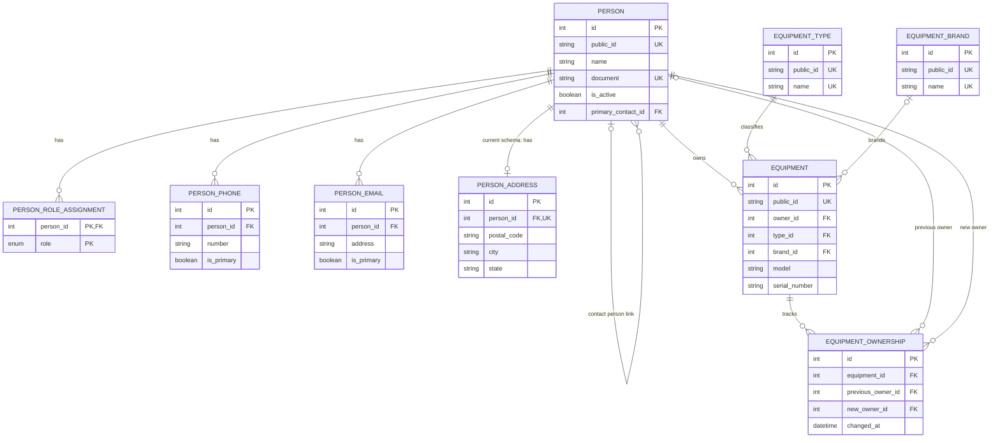

# Diagrama de Entidades

## Objetivo

Apresentar os relacionamentos do modelo atualmente implementado no Prisma. Este diagrama cobre apenas o primeiro recorte de cadastros e equipamentos.

## Status

Diagrama físico correspondente ao schema Prisma em 06/10/2026. A migration `20261006120000_initial_core` foi aplicada com sucesso no banco `gestor_os`, em MySQL Community Server 8.0.46, e a estrutura foi validada. Prisma Migrate controla o histórico pela tabela `_prisma_migrations`; não havia migration pendente no momento da validação. As decisões funcionais aprovadas em 07/10/2026 são descritas nas observações abaixo e ainda não foram aplicadas ao schema/banco.

## Última atualização

07/10/2026.

## Diagrama

## Observações

- O diagrama mostra relações e restrições principais; os campos completos estão em `docs/modelagem/Modelo-Banco.md` e `backend/prisma/schema.prisma`.
- Serial de equipamento não possui unicidade por decisão funcional: a aplicação poderá alertar sobre coincidências e permitir um novo cadastro.
- **Modelo físico atual:** `person_addresses.person_id` é único, então o banco aplicado aceita no máximo um endereço por Pessoa. A regra funcional aprovada em 07/10/2026 permite vários endereços; a unicidade deverá ser removida e Tipo de Endereço/principalidade modelados em migration futura. O diagrama continua mostrando o schema atual, não a estrutura futura.
- Os catálogos funcionais iniciais aprovados em 07/10/2026 são Tipos de Contato (Cliente, Fornecedor, Transportadora, Prestador de Serviço, Parceiro), Tipos de Endereço (Principal, Cobrança, Entrega, Instalação) e Tipos de Contribuinte (Contribuinte ICMS, Contribuinte Isento, Não Contribuinte). Essas categorias ainda não correspondem a tabelas no schema/banco aplicado; o diagrama não as representa como entidades físicas existentes.
- O ciclo de vida de catálogos auxiliares e a regra de duplicidade de Pessoa também são decisões funcionais ainda sem representação no schema: documento informado duplicado bloqueia; possível duplicidade sem documento avisa sem bloquear. Critérios exatos de busca e preservação de snapshot do nome antigo de opção editada seguem pendentes.
- **Modelo físico atual:** `person_roles.role` é enum. A regra funcional aprovada define papéis como Tipos de Contato simultâneos provenientes de cadastro próprio; a estrutura atual é parcial e deverá ser revista.
- A relação física de Pessoa de Contato é opcional, autorreferenciada em `people` e permite no máximo uma pessoa vinculada a cada cadastro. A coluna existente se chama `primary_contact_id`; a nomenclatura funcional aprovada é Pessoa de Contato.
- Para equipamentos, Marca e Fabricante são o mesmo conceito e haverá um único cadastro, representado fisicamente por `equipment_brands`.
- O schema atual ainda não representa integralmente os campos aprovados de Pessoa (Tipo de Pessoa, Nome Fantasia, inscrições, Tipo de Contribuinte, Observações e Aviso), nem os cadastros próprios de Tipo de Contato, Tipo de Contribuinte e Tipo de Endereço. Tipo de Pessoa e Nome/Razão Social são obrigatórios na regra funcional; essa obrigatoriedade de Tipo de Pessoa ainda não está representada no schema.
- `document` é opcional e unique no modelo físico. A regra funcional exige que CPF/CNPJ informado seja armazenado somente com números, matematicamente válido, único e compatível com PF/PJ. O schema atual não impõe normalização, validade ou compatibilidade; essas validações deverão ser feitas pela aplicação e ainda não foram implementadas.
- Nome Fantasia não se aplica a PF, é opcional para PJ e a Razão Social serve como referência de exibição quando ausente. IE/IM são opcionais, principalmente para PJ, e não terão validação estadual/municipal nesta etapa. Tipo de Contribuinte é opcional no cadastro geral e necessário na emissão de nota fiscal; regras fiscais completas continuam pendentes.
- Nenhuma dessas alterações de campos ou validações foi aplicada ao schema ou banco nesta etapa documental.

## Histórico de alterações

| Data | Alteração |
| --- | --- |
| 06/10/2026 | Primeiro diagrama do recorte de pessoas e equipamentos. |
| 07/10/2026 | Registro das regras funcionais aprovadas que divergem do modelo físico, incluindo campos obrigatórios de Pessoa e validação de CPF/CNPJ, sem representar migrations ainda não aplicadas. |
