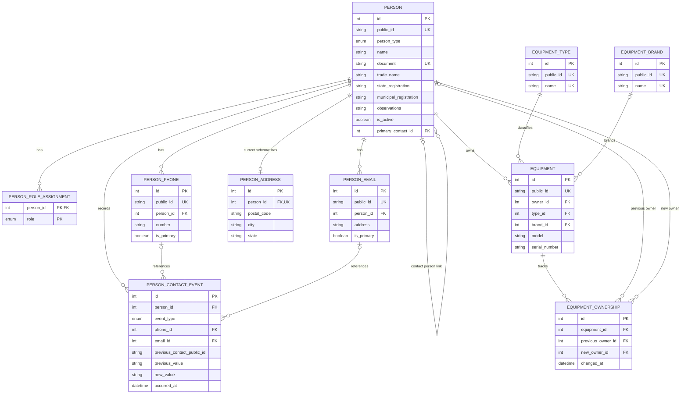
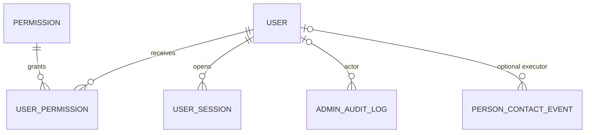

# Diagrama de Entidades

## Objetivo

Apresentar os relacionamentos do modelo atualmente implementado no Prisma. Este diagrama cobre apenas o primeiro recorte de cadastros e equipamentos.

## Status

Diagrama físico correspondente ao schema Prisma após as migrations `20261006120000_initial_core`, `20261007120000_person_basic` e `20261007183000_person_contacts`, aplicadas no banco `gestor_os`, em MySQL Community Server 8.0.46. Prisma Migrate controla o histórico pela tabela `_prisma_migrations`; `prisma migrate status` confirmou que não há migration pendente. O diagrama inclui contatos e eventos mínimos de Pessoa; demais decisões funcionais continuam identificadas abaixo como pendências.

## Última atualização

07/10/2026.

## Diagrama

## Modelo conceitual futuro de autenticação e autorização

O diagrama abaixo representa somente o desenho conceitual aprovado em 08/10/2026. `USER`, `PERMISSION`, `USER_PERMISSION`, `USER_SESSION` e `ADMIN_AUDIT_LOG` não existem no schema Prisma nem no banco aplicado. Não é modelo físico definitivo e não autoriza migration nesta etapa. A ligação de `PERSON_CONTACT_EVENT` ao usuário executor é opcional e depende de decisão sobre retenção e comportamento da FK.

O nome de usuário será único; Administrador cria contas e não há auto-registro. Sessões são opacas, revogáveis e expiráveis; apenas o hash do segredo será persistido. Permissões são diretas por usuário, sem perfis rígidos; Administrador é a autoridade máxima. O Log Administrativo é único para eventos administrativos e de segurança. Esses atributos são decisões conceituais, não colunas ou constraints aprovadas.

## Observações

- O diagrama mostra relações e restrições principais; os campos completos estão em `docs/modelagem/Modelo-Banco.md` e `backend/prisma/schema.prisma`.
- `equipment.serial_number` é opcional e possui índice não unique no schema atual. A regra funcional mais recente bloqueia serial repetido para o mesmo proprietário atual e avisa sem bloquear quando o proprietário é diferente; a aplicação deverá aplicar essa validação. Não há unicidade global de serial.
- **Modelo físico atual:** `person_addresses.person_id` é único, então o banco aplicado aceita no máximo um endereço por Pessoa. A regra funcional aprovada em 07/10/2026 permite vários endereços; a unicidade deverá ser removida e Tipo de Endereço/principalidade modelados em migration futura. O diagrama continua mostrando o schema atual, não a estrutura futura.
- Os catálogos funcionais iniciais aprovados em 07/10/2026 são Tipos de Contato (Cliente, Fornecedor, Transportadora, Prestador de Serviço, Parceiro), Tipos de Endereço (Principal, Cobrança, Entrega, Instalação) e Tipos de Contribuinte (Contribuinte ICMS, Contribuinte Isento, Não Contribuinte). Essas categorias ainda não correspondem a tabelas no schema/banco aplicado; o diagrama não as representa como entidades físicas existentes.
- O ciclo de vida de catálogos auxiliares ainda não está representado no schema. `document` informado possui unicidade; a API básica bloqueia documento repetido e, sem documento, avisa sem bloquear por nome normalizado idêntico. Comparações por telefone/e-mail continuam pendentes. Busca fuzzy está fora desta etapa. Catálogos usados poderão ser renomeados, com o nome atual no cadastro e o valor anterior/novo no histórico futuro.
- **Modelo físico atual:** `person_roles.role` é enum. A regra funcional aprovada define papéis como Tipos de Contato simultâneos provenientes de cadastro próprio; a estrutura atual é parcial e deverá ser revista.
- A relação física de Pessoa de Contato é opcional, autorreferenciada em `people` e permite no máximo uma pessoa vinculada a cada cadastro. A coluna existente se chama `primary_contact_id`; a nomenclatura funcional aprovada é Pessoa de Contato.
- Para equipamentos, Marca e Fabricante são o mesmo conceito e haverá um único cadastro, representado fisicamente por `equipment_brands`.
- Aviso permanece campo único futuro e não existe em `people`; pergunta, apresentação condicional, permissões e ausência de log de leitura são regras funcionais ainda não implementadas. Administrador tem poderes máximos; permissões individuais podem conceder ação equivalente a outro usuário. Master não existe.
- `people.is_active` existe no schema, mas a regra funcional proíbe excluir Pessoa fisicamente; somente Administrador ou usuário com permissão equivalente pode inativar/reativar. Pessoa inativa é consultável, mas não pode ser usada em novos vínculos operacionais. Equipamento só pode ser excluído sem qualquer registro persistido relacionado e com autorização correspondente; com vínculo, só pode ser inativado/reativado. O schema atual não possui status em `equipment`.
- `equipment.owner_id` referencia uma Pessoa sem exigir no schema que ela tenha Tipo de Contato Cliente ou esteja ativa. A validação funcional será necessária no cadastro e em transferência.
- OS registra a Pessoa informada na abertura sem exigir separação do proprietário real. Não haverá snapshot completo de Pessoa/Equipamento dentro de cada OS; o histórico de alterações e movimentações deve permitir acompanhar mudanças sem duplicar os cadastros. O schema atual não contém entidade OS nem mecanismo de histórico geral.
- `equipment_ownership_events` existe para eventos de titularidade. Transferência altera titular atual, registra evento e não reescreve OS antigas; pode ocorrer fora ou durante OS, com associação opcional à OS. Usuários autorizados podem alterar cadastros e transferir mesmo com histórico, sem justificativa obrigatória; as mudanças devem gerar histórico automaticamente. O modelo atual não registra tipos de histórico, usuário executor, justificativa ou vínculo com OS.
- O sistema terá histórico geral por entidade, conceitualmente com alteração de campo e evento/movimentação, valores anterior/novo quando aplicável, entidade, data/hora e usuário quando disponível. A estrutura física, lista final de eventos, classificação de acesso e filtros permanecem pendentes. O vínculo opcional de transferência a OS está aprovado funcionalmente, mas não existe entidade OS nem chave de vínculo no schema.
- Telefone, e-mail e endereço admitem no máximo um principal por Pessoa e coleção, sem exigir que exista principal; marcar outro desmarca o anterior. Índices funcionais aplicados garantem principalidade única para telefones e e-mails. Vários endereços do mesmo Tipo são permitidos funcionalmente, mas o schema ainda restringe endereço a zero ou um por Pessoa.
- **Contatos implementados:** a migration `20261007183000_person_contacts` adiciona `public_id` único a telefones/e-mails, unicidade de e-mail por Pessoa, índices funcionais de principalidade e a tabela `person_contact_events`. As rotas diretas de `POST`/`GET` são descritas em `docs/04-API.md`; `label` permanece fora da API, sem edição/remoção/inativação e sem rota de histórico. A inclusão exige confirmação cadastral; telefone não padrão até 32 dígitos exige confirmação específica. E-mail segue a gramática ASCII documentada na API. As operações persistem contato, principalidade e eventos na mesma transação. A tabela de eventos não possui CHECK físico para XOR entre `phone_id`/`email_id` ou coerência de `event_type`; o service valida essas combinações. Autenticação e guards continuam pendentes, portanto as rotas não estão prontas para produção.
- Catálogos iniciais serão carregados por seed idempotente sob comando controlado, sem execução automática ao iniciar o Backend; a estratégia técnica de identificadores e preservação de alterações será definida na implementação.
- Regra de serial aprovada: repetição para o mesmo proprietário atual bloqueia; para proprietário diferente avisa e permite cadastro, sem sugerir transferência. Sem serial, salva sem busca automática por proprietário + Tipo + Marca + Modelo. Serial é armazenado em caixa alta sem remover símbolos ou alterar espaços, inclusive no início/fim; `ABC-123` e `ABC123` são diferentes. Pesquisa de equipamentos é independente de duplicidade: localiza por proprietário/Pessoa/Cliente, Tipo, Marca, Modelo, serial e Status; Modelo aceita texto, serial aceita busca exata ou parcial, Status permite Ativo/Inativo/Todos e inativos ficam ocultos por padrão. Detalhes de pesquisa avançada/filtros combinados permanecem pendentes.
- Equipamento exige funcionalmente Proprietário, Tipo de Equipamento, Marca, Modelo e Status; serial é opcional. O schema atual deixa `brand_id` e `model` opcionais e não tem status de Equipamento. Status funcionais são apenas Ativo/Inativo, com novo Equipamento Ativo; estados adicionais estão fora desta etapa.
- `equipment_types` e `equipment_brands` não possuem status no schema atual. A regra funcional permite exclusão física apenas antes do uso; usados podem ser editados/inativados, mas não apagados, e inativos não são opções padrão em novos Equipamentos. Renomeação após uso é permitida: o catálogo mantém o nome atual e o histórico registra nome anterior/novo, data/hora e usuário quando disponível; snapshots em cada referência não serão adotados.
- Tipo de Equipamento e Marca possuem catálogos iniciais aprovados como cadastros próprios expansíveis, não enums fixos; serão carregados por seed idempotente sob comando controlado, sem execução automática no startup. Regra geral de caixa alta, e-mail minúsculo com trim, telefone/CEP numéricos e pesquisa são comportamentos de aplicação. Telefone com 10 dígitos é aceito como fixo; com 11, como celular se o primeiro após DDD for 9; outros formatos entre 1 e 32 dígitos geram aviso não bloqueante com possibilidade de confirmar. Sem dígitos ou acima de 32, bloqueia no recorte aprovado. Na ficha, usuário autorizado pode alterar dados com ou sem histórico, sem justificativa obrigatória; mudanças são registradas automaticamente. Proprietário com histórico exige transferência formal. Isso não altera o ciclo de vida dos cadastros auxiliares de Tipo e Marca.
- Usuário com permissão correspondente pode consultar histórico operacional básico de Pessoa, Equipamento e OS; Administrador pode consultar o histórico completo. Histórico do Aviso e histórico técnico/auditoria exigem Administrador ou permissão explícita equivalente. O schema Prisma/migration atual não contém essa estrutura, não impõe a matriz de permissões e não implementa a confirmação antes de salvar.
- `people.person_type` PF/PJ é obrigatório e sem default; Nome/Razão Social também é obrigatório. Nome Fantasia, inscrições e Observações já existem como campos opcionais. Tipo de Contribuinte e Aviso, assim como os cadastros próprios de Tipo de Contato, Tipo de Contribuinte e Tipo de Endereço, continuam ausentes do schema.
- `document` é opcional e unique no modelo físico. A API básica valida CPF numérico e CNPJ numérico ou alfanumérico oficial, normaliza o valor canônico, confere compatibilidade com PF/PJ e bloqueia duplicidade. `VARCHAR(14)` comporta os 14 caracteres do CNPJ. A coluna por si só não impõe cálculo dos dígitos, normalização ou compatibilidade; essas validações são realizadas no Backend.
- Nome Fantasia não se aplica a PF, é opcional para PJ e a Razão Social serve como referência de exibição quando ausente. IE/IM são opcionais, principalmente para PJ, e não terão validação estadual/municipal nesta etapa. Tipo de Contribuinte é opcional no cadastro geral e necessário na emissão de nota fiscal; regras fiscais completas continuam pendentes.
- As migrations inicial, de Pessoa básica e de contatos foram aplicadas. As demais decisões funcionais descritas neste documento continuam pendentes.
- O desenho conceitual de Auth aprovado não representa tabelas implementadas; as sete rotas de Pessoas permanecem sem proteção e não estão prontas para produção.

## Histórico de alterações

| Data | Alteração |
| --- | --- |
| 06/10/2026 | Primeiro diagrama do recorte de pessoas e equipamentos. |
| 07/10/2026 | Registro das regras funcionais aprovadas que divergem do modelo físico, incluindo campos obrigatórios de Pessoa e validação de CPF/CNPJ, sem representar migrations ainda não aplicadas. |
| 07/10/2026 | Complemento das observações com Aviso, exclusão/inativação, Pessoa informada na abertura da OS e titularidade, mantendo o diagrama limitado ao schema físico atual. |
| 07/10/2026 | Registro das regras aprovadas de serial, campos obrigatórios, status Ativo/Inativo e ciclo de vida de Tipo de Equipamento/Marca, sem alterar o diagrama físico atual. |
| 07/10/2026 | Registro dos catálogos iniciais de Tipo de Equipamento e Marca, normalização, pesquisa, alterações permanentes e vínculo opcional de transferência com OS, sem alterar o diagrama físico. |
| 07/10/2026 | Atualização do diagrama para refletir a migration de Pessoa básica já aplicada e separar os campos implementados das regras ainda pendentes. |
| 08/10/2026 | Registro da decisão de documento: CPF numérico; CNPJ numérico antigo ou alfanumérico oficial, canônico sem pontuação e em maiúsculas; schema/migration permanecem inalterados naquela atualização documental. |
| 07/10/2026 | Registro do recorte de contatos aplicado, incluindo eventos mínimos e índices de principalidade. |
| 08/10/2026 | Registro do contrato técnico final aprovado para contatos, histórico mínimo e integridade futura, sem alterar o diagrama físico aplicado. |
| 08/10/2026 | Inclusão do diagrama conceitual futuro de autenticação/autorização, separado do modelo físico implementado. |
